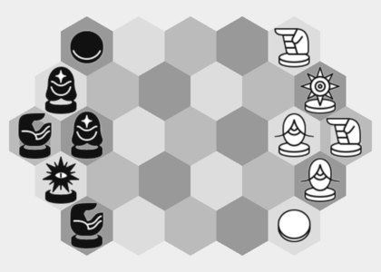
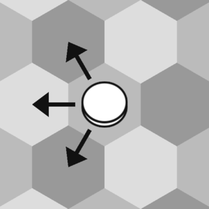
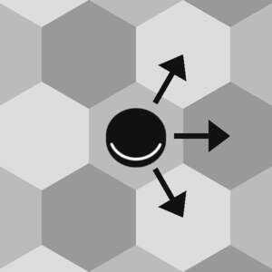
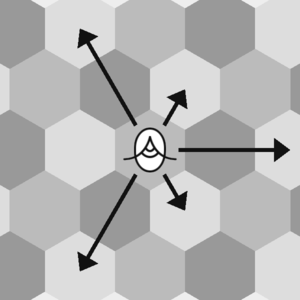
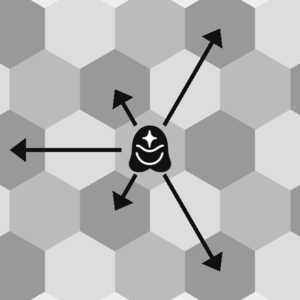
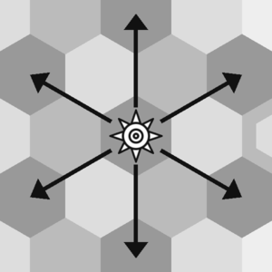
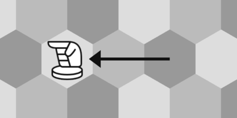

# Rules

## Setup

A board of 29 hexagonal tiles is setup as follows.

White, who moves first, starts on the right side and moves to the left. For white pieces, the forward direction is left.

Black starts on the left and moves to the right. For black pieces, forward is right.

The rightmost tile is White's **house**, the leftmost tile is Black's house.

The pieces are laid out like this

It is important that White's Star is on a dark tile, and Black's is on a light tile.

## Pieces

All pieces move and attack according to some specific pattern. When they move more than one tile distance, they always jump over any obstacle.

### Flats

**Flats** move one tile forward, or one tile forward-sideways.

When a flat reaches the opponent's house, the player immediately wins.

### Arm

The **Arm** or **Hand** can move either two tiles forward, one tile backwards, or one tile backward-sideways.

### Blind

The **Blind** can move either two tiles forward-sideways, two tiles backwards, or one tile backward-sideways.

All the tiles the Blind can move to on a given turn are the same color. In fact, the White Blind always cycles mid -> light -> dark -> mid, and the Black Blind always cycles mid -> dark -> light -> mid.

### Star

The **Star** can only move one step diagonally, along the edges of the tiles. More simply, the Star is bound to its original tile color, and can move to the six closest tiles of the same color.

Thus, the White Star is bound to dark tiles, and the Black Star is bound to light tiles.

### Talls and Stacking

A **tall-piece** (Arm, Blind, Star) may move into a flat *of the same color*, so that they **stack** and occupy the same tile. (A flat cannot move into a tall to stack under it.)

When stacked, the flat is essentially inactive, as it can neither move nor attack. The tall, instead, attacks and is free to move off the flat. 

Stacks are just as vulnerable to attacks as the lone pieces.

## Turns

A player's turn consists of two stages:

### Movement

The player **must** move one of their pieces by a legal move according to the patterns above. If there are no legal moves available, the player has lost (**stalemate**).

### Attack 

**All** of the player's pieces (including those that were not just moved) automatically attack all of the opponent's pieces. A tile is under attack if a player's piece could move into it. An opponent's piece is captured and removed from play if it is under attack from **at least two pieces**. Stacked pieces are equally vulnerable, and will die together.

An attacking piece may contribute to attacking multiple targets at the same time.

(Note: the opponent does *not* counter-attack during this stage. Only the player that just moved attacks.)

## Win

The game can finish in either of two ways:

- **House Capture**: If a player's **flat** (not a tall) reaches the opponent's house tile, that player wins.
- **Stalemate**: If a player starts their turn with no legal moves, they lose.

### Draw by repetition

While unlikely, it is possible to have a non-terminating game. If the same position repeats three times, the game may be declared a draw. This implementation does not apply this rule, and bots do not correctly account for it.